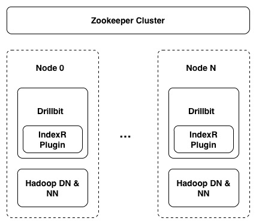
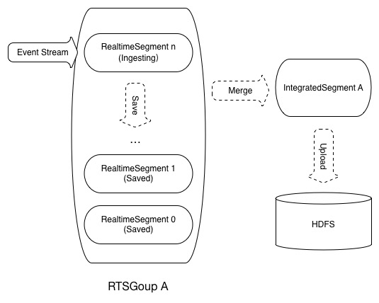
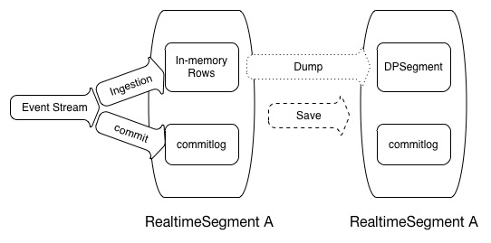

IndexR，一个千亿级别的实时分析数据库
===

## 背景

[舜飞](http://www.sunteng.com/)的各个业务线对接全网的各大媒体及APP，从而产生大量数据，实时分析这些数据不仅仅用于监控业务的发展，还会影响产品的服务质量，直接创造价值。比如优化师要时刻关注活动的投放质量，竞价算法会根据投放数据实时调整策略，网站主会进行流量分析和快速事故反馈等等。

这些分析需求的特点：

* **超大量** - 数据流达到1m/s，一天入库几百亿条消息。
* **准实时** - 全部数据要实时处理、入库、分析、展现，从产生到体现在分析结果里延时几秒以内。传统的批处理根本无法满足需求。
* **全量、准确、可靠** - 不能采用抽样、近似计算等方式，数据就是流动的金钱，可靠性要求非常高。
* **多维分析、Ad-hoc查询** - 大部分的查询结果是基于一个或多个维度组合的汇总，并且要求短时间内响应，最好能支持SQL。

先来看看目前有哪些解决方案：

* MySQL，PostgreSQL等关系型数据库，它们一般都有非常完整的功能支持，但无法支持超大量数据，统计分析的性能也不好，一般作为T+1架构的实时库。
* Hbase，或者Redis等K-V数据库，上层一般有一个SQL查询层，比如Phoenix，上游由Spark、Storm等流式框架预聚合数据。这类架构限制非常多，很难支持复杂及频繁修改的业务。Kylin也属于这一类，离线预聚合。
* Infobright，Greenplum，MemSQL等各有特点的数据库，有开源社区版本。在一定条件、数据量下能满足特定需求，但是缺点较多，有些不支持更新，或者运维困难，数据量支持小等。
* Hana, Vertica，以及云服务等收费数据库。我们没有选择这个方向，认为把分析系统构建在这类第三方封闭系统上，与目前现有数据工具的整合相对困难，担心对后续扩展、迁移的影响。
* 最近几年较火的所谓时间序列数据库，代表为Druid，Pinot，Influxdb等。笔者曾经比较深入的研究过，甚至在项目中有过部署，但最终认为都不适合。有些项目并不成熟，或者对硬件要求极高，缺少弹性，有些架构上有比较大的问题，实际应用时表现的非常不稳定。
* 其他开源分析工具，如Impala，Drill，或者SparkSQL。它们一般专注于计算层，缺少一个合适的数据格式，并且它们通常是分析静态文件的，没法做到分析实时数据。目前的Parquet，ORC等数据格式通常有不错的扫描、压缩性能，但缺少有效的索引和必要的灵活性。

既然现有方案都不能解决问题，我们最终决定自己做一个合适的数据库系统，叫做**IndexR**。并在一年之后，成功部署于生产环境。

## IndexR简介

IndexR是一个基于HDFS的分布式关系型列式数据库，擅长海量历史、实时数据的快速统计分析。

* **快速统计分析查询** - IndexR使用列式存储，对于超大量数据集，它提供高效的索引，通过过滤掉无关数据，快速定位有效数据，减少IO。它使用了优秀的[Apach Drill](https://drill.apache.org/)作为上层查询引擎。特别适合于ad-hoc的OLAP查询。
* **数据实时导入** - IndexR支持超高速实时导入数据。数据一到达IndexR节点，立刻可以被查询到。实时数据和历史数据可以一起查，再也不需要考虑所谓T+1架构。且区分于其他有类似功能的系统，IndexR永远不会主动丢弃任何数据。
* **高效硬件利用率** - 相较于其他系统，IndexR可以跑在廉价的机器上。不需要昂贵的SSD硬盘，高端CPU，甚至小型机，你就可以获得非常好的性能，虽然在上面跑会更加快。虽然跑在JVM上，它手动管理几乎所有的内存，使用经过高度设计、紧凑的数据结构。
* **集群高可用，易扩展，易管理，简单** - 分布式系统发展到现在，高可用和扩展性已经是标配了。IndexR的特点是结构非常简单可靠，且只有极少的必须配置项。
* **与Hadoop生态的深度整合** - IndexR把数据存放于HDFS。这意味着你可以使用MapReduce，或者任何Hadoop工具处理这些文件。我们目前提供了Hive插件，用于各种ETL相关工作，或者跑离线任务。对接Spark的工作正在进行，将被使用于数据挖掘以及机器学习。
* **高度压缩的数据格式** - IndexR以列式存储，并提供超高的压缩率，可以显著的减少IO以及网络开销。
* **方便的数据管理** - IndexR可以方便的导入、删除数据，并且支持修改表Schema，如对列的添加、删除、修改等。

## IndexR架构介绍

### 系统结构

IndexR参考和使用了很多优秀的开源产品，充分发挥了各个组件的优势，并填补了缺失的模块，组成一个非常简洁、可靠、高效的数据库系统。

IndexR系统主要涉及几个组件

* IndexR - 负责文件存储格式，包括索引和数据，数据的实时导入、表定义操作，查询优化，以及数据缓存等。
* 分布式计算框架（Drill/Spark）-负责在IndexR数据上的具体查询操作，以及其他计算任务。
* Hadoop以及周边工具 - 提供分布式文件存储，离线批量计算，离线数据管理，以及各种离线ETL任务。IndexR与Hadoop完美结合，可以作为一个高度压缩、自带索引的文件格式，兼容Hive的所有操作。
* Kafka - 队列，数据经过kafka流入IndexR。
* Zookeeper - 集群状态管理。

### 部署架构

IndexR数据库系统部署非常简单，没有复杂依赖，没有难以理解的不同类型的节点，如果你已经拥有一个Hadoop系统，即使没有任何经验，在现有集群上部署IndexR通常可以在半小时之内完成。只需要在所有Hadoop的DataNode（和NameNode）节点上部署一份带有IndexR插件的Drill节点，只有几项必须配置项，并且所有节点的配置都是一样的。

IndexR的服务逻辑嵌入了Drillbit进程，无需再另外启动服务。

### 存储结构

IndexR以列式存储数据，并分片存储，分片称为Segment，每一个Segment都是自解释的，包括Schema，数据以及索引。Segment通常是固定不变的，是这极大简化了数据管理，便于分布式处理。

### 实时模块

IndexR的一大特点是可以极高效率的导入实时数据，并且数据可以立刻被查询，可以多节点同时导入。

实时导入的数据叫做Realtime Segment，在达到一定阀值后，IndexR会将它们合并成历史Segment，并上传到HDFS，之后数据就可以被离线分析工具所使用和管理。

Realtime Segment具体实现参考了 LSM-Tree。通过在磁盘上的commitlog文件保存所有更新操作，最新数据放在内存中以快速入库和索引，周期性将内存数据dump到磁盘。IndexR进程可以随时被重启，或者直接杀死，不用担心数据丢失。

## 性能标准

测试硬件标准：每个节点 12核(24线程)CPU, 60G内存, SATA接口7200转机械硬盘.

* **实时导入速度** - 超过 30K 消息/秒/节点/表。即，假如有10个节点，每个节点拥有10个表，可以在一秒钟之内消费3M条消息。一天轻松实时导入千亿数据。
* **扫描速度** - 通常一行内通常会读取多个字段，在现代CPU和计算框架的帮助下，可以同时对多个字段进行运算，从而获得比以下数据更好的性能。
	* 冷数据 - 30M字段/秒/节点
	* 热数据 - 100M字段/秒/节点
	* 扫描速度约为Parquet的2.5倍。
* **OLAP查询** - 在我们的实际业务中，我们发现95%的查询延时在3s内，数据量规模为千亿级别，20个节点。
	* 相同的Drill环境下约为Parquet格式的3~8倍。
* **压缩率** - 在我们的实际业务中，相对于CSV格式,压缩率为10:1，极限情况下达到20:1。
	* 压缩后大小约为ORC格式的75%。

## 关于作者

笔者(Flow Wei)目前任职于舜飞科技数据中心部门，主要负责数据平台建设，主导开发了IndexR项目。

近几年数字营销以及相关行业在国内可谓发展迅速，包括各种PC、移动媒体，各大 ADX，DSP，SSP，DMP，以及网站和APP监控平台，深刻的影响着广告主的宣传策略和消费者的消费体验，精准、高效、低成本的营销方式越来越获得市场的认可，特别是品牌广告主的大力支持使得这个领域显得热闹非凡。[**舜飞科技**](http://www.sunteng.com/)作为国内顶级的DSP服务提供商，拥有覆盖全行业的产品线，发展迅速，技术主导，成绩斐然。

目前公司发展迅速，高级数据开发，数据分析、挖掘，平台架构，高性能服务器等职位虚位以待。我们青睐对自身领域有深入了解，有强烈求知欲，喜欢正面解决问题的你。快发送简历至<hr@sunteng.com>，使用暗号IndexR可走快速通道哦。